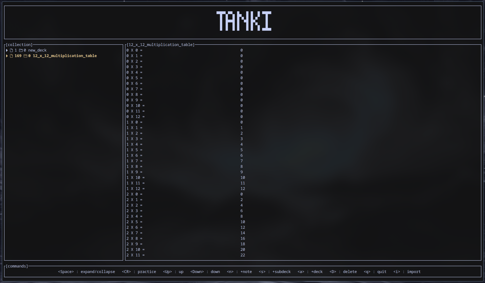

# Tanki

A terminal-based flashcard application written in Rust, inspired by Anki. Tanki allows you to import Anki decks, review cards in a focused TUI, and manage your study collection efficiently from the command line.



## Install
```
curl https://github.com/manavsu/tanki/releases/download/v0.1.0/install_tanki.sh | sh
```
## Uninstall
```
curl https://github.com/manavsu/tanki/releases/download/v0.1.0/install_tanki.sh | sh
```
